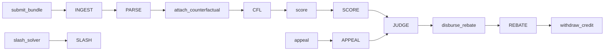

# TIME·MACHINE — MevFairCourt

**Operation type:** REBATE  Â·  **Domain:** DEX bundle MEV fairness  Â·  **Architecture:** pipeline of stages

A GenLayer intelligent contract that scores a DEX bundle's extracted value against a counterfactual ordering and accrues pro-rata rebate credit to the victims — adjudicated by a validator panel running four reconciled LLM sites and three web-fetch points.

**Live:** https://marwikoo.github.io/mev-fair/  
**Contract:** `0xa8513697719790BE49dEbE812f66830094852588` on GenLayer Studionet (chain 61999)

---

## Contract specification

### Pipeline architecture

Every public write delegates to a sequence of named stage classes. The contract class itself contains no business logic — only orchestration. Each step is recorded in an on-chain `stage_log` on the bundle.



| Stage | Class | Responsibility |
|-------|-------|----------------|
| INGEST | `IngestStage` | Validates bundle ID uniqueness, bond minimum, non-empty blob and hash |
| PARSE | `ParseStage` | Deserializes swaps JSON; rejects non-list, empty, or malformed blobs |
| CFL | `CounterfactualStage` | Fetches an oracle URL and LLM-cleans response into canonical counterfactual shape |
| SCORE | `ScoreStage` | LLM scores extracted bps vs. counterfactual with per-victim share |
| JUDGE | `JudgmentStage` | Maps extracted bps to a fairness band |
| REBATE | `RebateStage` | Splits solver bond 25%/75% between court and victims pro-rata; accrues credit |
| APPEAL | `AppealStage` | Fetches a second oracle, rescored-LM, reconcile with tie-breaker |
| SLASH | (inline in `slash_solver`) | Marks a PREDATORY solver record, zeroes the bond |

### Non-determinism budget

The contract satisfies the GenLayer matrix requirement of ≥4 LLM sites and ≥3 web fetches.

| # | Site | Component | Input |
|---|------|-----------|-------|
| LLM-1 | `_llm_clean_oracle_json` | CounterfactualStage | Oracle URL + raw JSON blob |
| LLM-2 | `_llm_score_bundle` | ScoreStage | Bundle ID, swaps, counterfactual |
| LLM-3 | `_llm_appeal_rescore` | AppealStage | Bundle ID, swaps, appeal counterfactual |
| LLM-4 | `_llm_break_tie` | AppealStage | Old and new bps when within tolerance |
| FETCH-1 | `_fetch_oracle_counterfactual` | CounterfactualStage | Primary oracle URL |
| FETCH-2 | `_fetch_appeal_oracle` | AppealStage | Secondary oracle URL |
| FETCH-3 | `_fetch_block_explorer` | (custom) | Explorer URL + block number |

### Error envelope

All reverts are tuple-encoded as `<STAGE:SEVERITY:detail>` strings.

- **HARD** — deterministic precondition failure (e.g. `bundle_already_submitted`)
- **SOFT** — transient network failure (e.g. `oracle_5xx:503`)
- **MODEL** — LLM non-determinism (e.g. `non_dict_response`)

### Fairness bands

| Band | Bps range | Behavior |
|------|-----------|----------|
| FAIR | ≤ 30 | No rebate triggered |
| BORDERLINE | 31–60 | Rebate accrues |
| EXTRACTIVE | 61–150 | Rebate accrues; elevated scrutiny |
| PREDATORY | > 150 | Rebate accrues; `slash_solver` enabled |
| PENDING | not yet scored | Initial state at `submit_bundle` |

### Slash split

```
Court treasury:   2500 bps (25 %)
Victims pro-rata: 7500 bps (75 %)
```

---

## Public surface

### Writes (8)

| Method | Payable | Stages run | Purpose |
|--------|---------|------------|---------|
| `submit_bundle` | yes (bond) | INGEST → PARSE | Solver posts a bundle hash, swaps JSON, and fair-trade attestation |
| `file_complaint` | yes (bond) | — | Victim claims harm in bps against a specific bundle |
| `attach_counterfactual` | no | CFL | Fetch an oracle URL and derive canonical counterfactual ordering |
| `score` | no | SCORE → JUDGE | LLM-vs-validator panel assigns extracted bps and band |
| `disburse_rebate` | no | REBATE | Re-score, then accrue pro-rata credit to complainants |
| `appeal` | yes (bond) | APPEAL | Second oracle rescored; tie-breaker if within tolerance |
| `withdraw_credit` | no | — | Victim pulls accrued credit (accounting-only; actual value transfer off-chain per GenLayer convention) |
| `slash_solver` | no | — | Zero the bond of a PREDATORY bundle's solver |

### Views (7)

| View | Returns |
|------|---------|
| `bundle` | Full dossier: solver, block, hash, blob, extracted bps, band, bond, sequence marks |
| `bundle_stage_log` | Ordered pipeline-stage log entries |
| `complaints_of` | All complaints filed against a bundle with awards |
| `pending_credit` | Accrued rebate credit for any address |
| `band` | Current fairness band shortcut |
| `count_by_band` | Bundle counts per band |
| `solver_record` | Solver's submitted / predatory / slashed history |

---

## Frontend

The React dashboard lives in `frontend/`. Two routes:

| Route | Component | Function |
|-------|-----------|----------|
| `/` | `Landing` | Hero, what-is, how-it-works stepper, mechanics, live `count_by_band()` bands, FAQ accordion |
| `/court` | `Court` | Workspace with left rail (tracked bundles, complaints, credit), center stage (selected bundle, gauge, timeline, meta), right rail (8 action panels), bottom drawer (raw data) |

The frontend connects to the deployed MevFairCourt via `genlayer-js` reads through an ephemeral read-only client and writes through a wallet-backed client obtained from the connected RainbowKit provider. No private key is held by the page.

Dependencies: React 18, react-router-dom 6, genlayer-js, wagmi, viem, RainbowKit, GSAP, D3, Konva, Zdog.

### Local development

```bash
cd frontend
npm ci
npm run dev          # dev server at http://localhost:5380
npm run build        # tsc + vite production build
npm run preview      # serve the built artifact at http://localhost:5392
```

### Environment

The committed `frontend/.env` contains the public Studionet configuration:

| Variable | Value |
|----------|-------|
| `VITE_CONTRACT_ADDRESS` | `0xa8513697719790BE49dEbE812f66830094852588` |
| `VITE_CHAIN_ID` | `61999` |
| `VITE_RPC_URL` | `https://studio.genlayer.com/api` |

Override locally via `frontend/.env.local` — never commit local overrides.

---

## Deploying the contract

```bash
npx genlayer deploy --contract backend/mev-fair.py
```

The contract was deployed 2026-06-23 on hosted studionet (the local node at `127.0.0.1:4000` was unreachable). The deployer address `0xD61ee8b699f7543dcbF9C6CfDE38A837902De4E5` holds the funded wallet.

### Known limitation

`disburse_rebate` re-invokes `_llm_score_bundle` at rebate time (the contract has no post-judgment cache). On open-ended scoring prompts the validator outputs may diverge beyond `_agree_on_bps` tolerance (±10 bps / ±15 confidence), causing `UNDETERMINED / MAJORITY_DISAGREE`. The `score` call itself reaches consensus reliably, often on retry. A more deterministic design would reuse the finalized `per_victim`/`extracted_bps` instead of re-querying the model at disbursement.

---

## License

MIT
